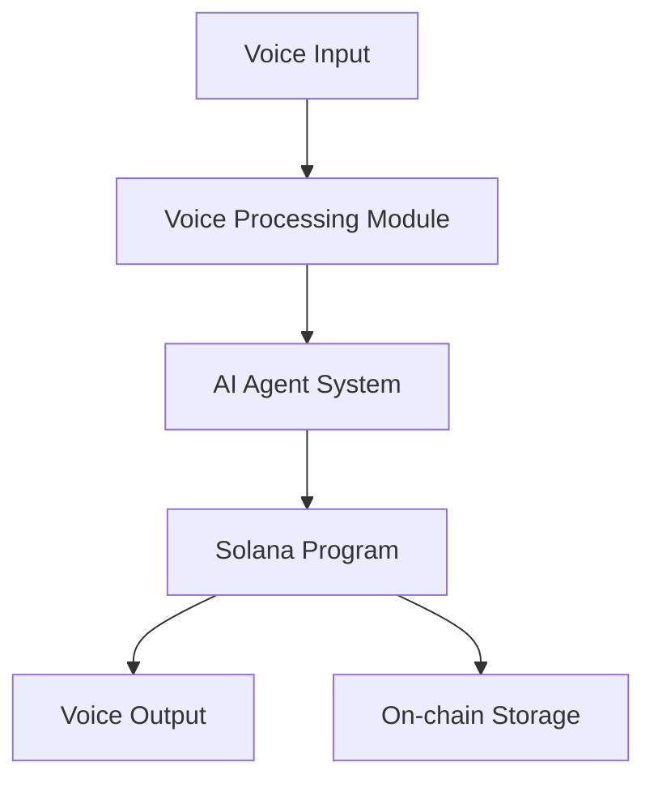

# Harko  - Real-time Voice AI Agent Framework on Solana

<div align="center">
    <h3>🎙️ Decentralized Real-time Voice AI Framework</h3>
</div>

## 🌟 Overview

Harko  is a groundbreaking AI agent framework that enables real-time voice interactions on the Solana blockchain. By combining advanced voice processing capabilities with blockchain technology, Harko  creates a decentralized platform for voice-based AI agents.

## ✨ Features

- **🎙️ Real-time Voice Processing**
  - Low-latency voice streaming
  - Voice-to-text conversion
  - Text-to-speech synthesis
  - Noise reduction and enhancement

- **🤖 AI Agent System**
  - Natural language understanding
  - Context-aware responses
  - Multi-agent communication
  - Adaptive learning capabilities

- **⚡ Solana Integration**
  - On-chain voice data storage
  - Decentralized agent coordination
  - High-throughput processing
  - Low transaction costs

- **🔐 Security & Privacy**
  - End-to-end encryption
  - Decentralized identity management
  - Privacy-preserving voice processing
  - Secure key management

## 🏗️ Architecture



## 🚀 Quick Start

### Prerequisites

```bash
# Install Rust and Solana
curl --proto '=https' --tlsv1.2 -sSf https://sh.rustup.rs | sh
sh -c "$(curl -sSfL https://release.solana.com/v1.16.0/install)"

# Install Node.js and Python
nvm install 18
pyenv install 3.9
```

### Installation

1. Clone the repository:
```bash
git clone https://github.com/harko-ai/harko .git
cd Harko 
```

2. Install dependencies:
```bash
# Solana program dependencies
cd program
cargo build

# Web application dependencies
cd ../app
npm install

# AI components
cd ../ai
pip install -r requirements.txt
```

## 📦 Project Structure

```
Harko /
├── program/            # Solana smart contracts
│   ├── src/           # Contract source code
│   └── tests/         # Contract tests
├── app/               # Web application
│   ├── src/          # Frontend source code
│   └── public/       # Static assets
├── ai/               # AI components
│   ├── src/          # AI model implementations
│   └── tests/        # AI system tests
└── docs/             # Documentation
```

## 💡 Key Components

### Voice Processing
- Real-time audio streaming using WebRTC
- Voice activity detection
- Background noise suppression
- Echo cancellation

### AI System
- Natural Language Processing (NLP)
- Speech recognition and synthesis
- Context management
- Multi-agent coordination

### Blockchain Integration
- Voice data storage on Solana
- Agent state management
- Transaction processing
- Cross-program invocation

## 🔧 Development

1. Start local Solana validator:
```bash
solana-test-validator
```

2. Deploy Solana program:
```bash
cd program
anchor deploy
```

3. Start web application:
```bash
cd app
npm run dev
```

4. Run AI system:
```bash
cd ai
python src/main.py
```

## 🧪 Testing

```bash
# Run Solana program tests
cd program
anchor test

# Run web application tests
cd app
npm test

# Run AI system tests
cd ai
pytest
```

## 📖 Documentation

- [Technical Architecture](./docs/architecture.md)
- [Voice Processing System](./docs/voice-processing.md)
- [AI Agent Protocol](./docs/ai-agent.md)
- [Solana Integration](./docs/solana.md)
- [API Reference](./docs/api.md)

## 🤝 Contributing

We welcome contributions! Please see our [Contributing Guidelines](CONTRIBUTING.md).

## 📄 License

This project is licensed under the MIT License - see the [LICENSE](LICENSE) file for details.

## 🔮 Roadmap

- [x] Core voice processing implementation
- [x] Basic AI agent framework
- [x] Solana program integration
- [ ] Advanced voice features (emotion detection, speaker identification)
- [ ] Multi-language support
- [ ] Mobile application
- [ ] Cross-chain integration
- [ ] Governance system

## 📞 Contact

- GitHub: [@harko](https://github.com/harko-ai/harko)
- Twitter: [@Harko AI](https://x.com/harko_voice)

---

<div align="center">
    Made with ❤️ by the Harko  Team
</div>
